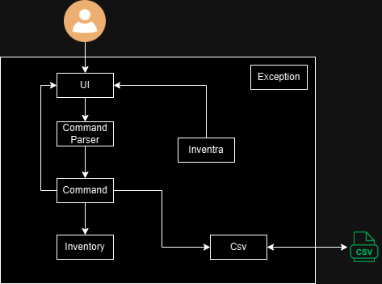
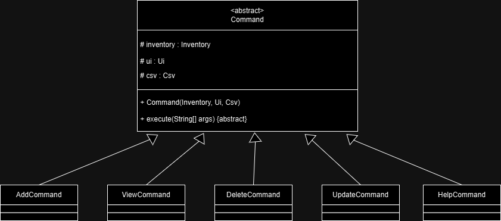
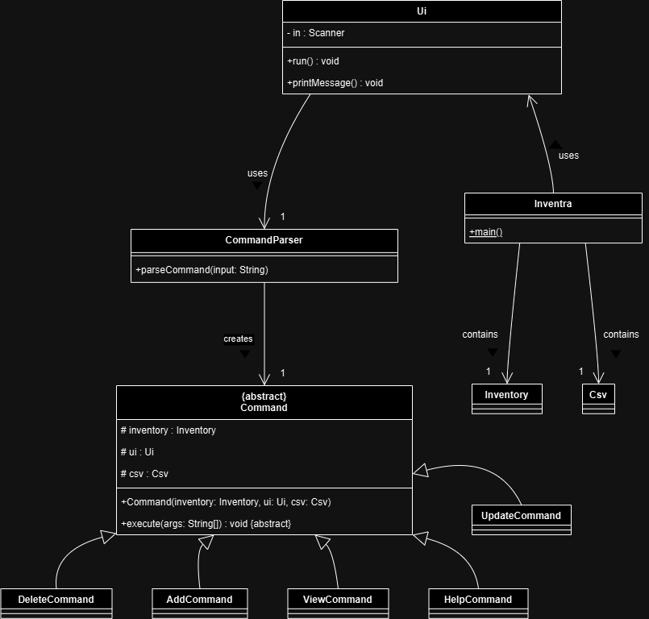
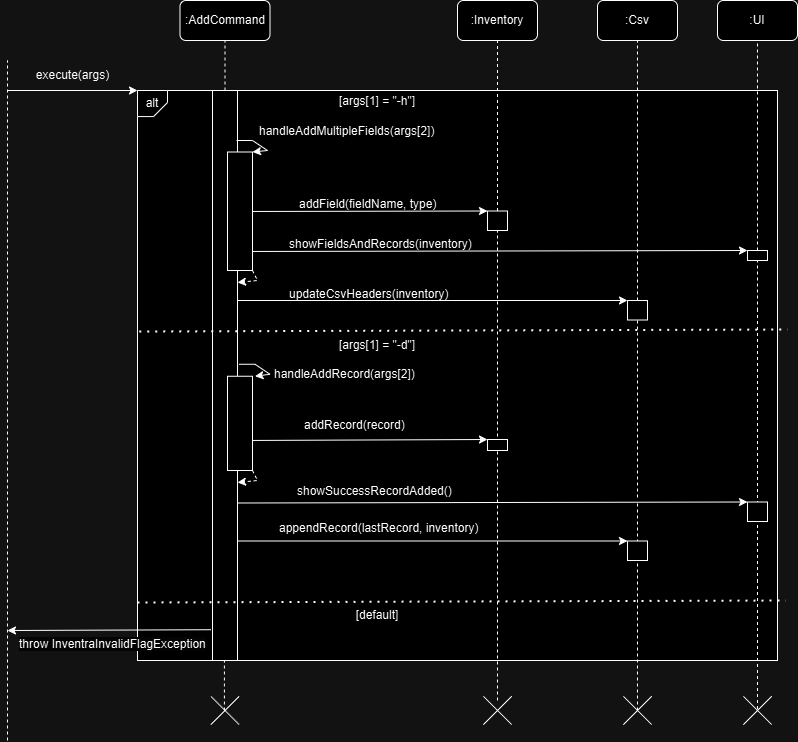
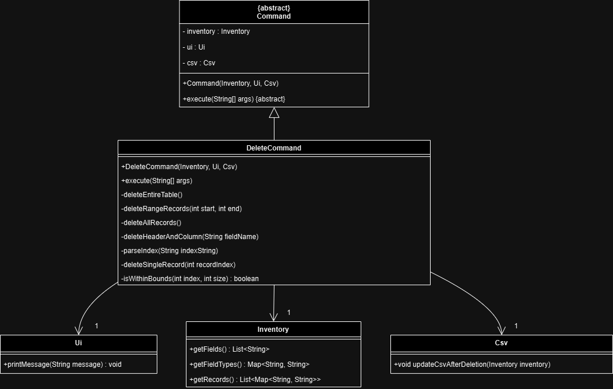
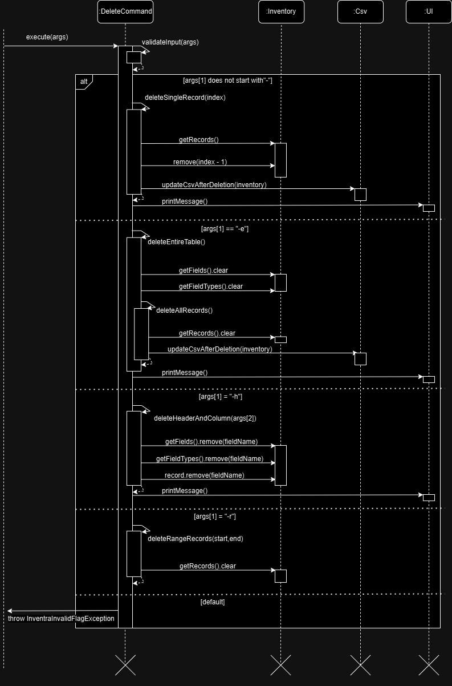
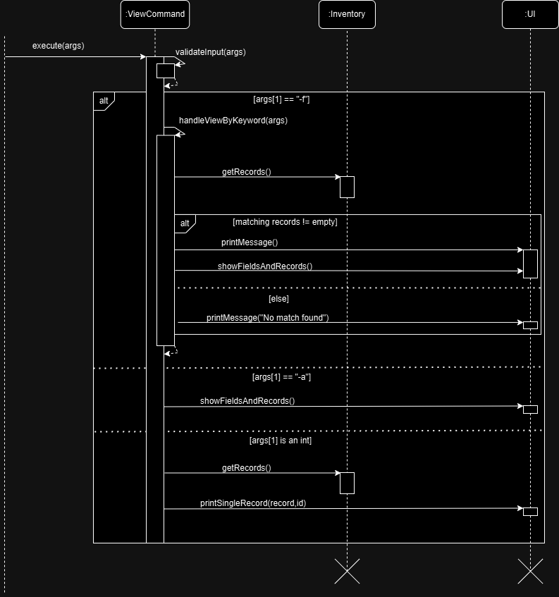

# Inventra Developer Guide

[View on GitHub](https://github.com/AY2425S1-CS2113-T11-4/tp)

## Table of Contents
- [Acknowledgements](#acknowledgements)
- [Design & Implementation](#design--implementation)
  - [Architecture](#architecture)
  - ["Add" Command Feature](#add-command-feature)
  - ["Delete" Command Feature](#delete-command-feature)
  - ["Update" Command Feature](#update-command-feature)
  - ["View" Command Feature](#view-command-feature)
- [Product Scope](#product-scope)
- [User Stories](#user-stories)
- [Non-Functional Requirements](#non-functional-requirements)
- [Glossary](#glossary)
- [Instructions for Manual Testing](#instructions-for-manual-testing)

### Acknowledgements
The following resources and libraries were referenced or adapted in this project:
* Java Coding Standard (Basic): [Official Documentation](https://se-education.org/guides/conventions/java/basic.html)
* Code Quality (Guide): [Documentation](https://nus-cs2113-ay2425s1.github.io/website/se-book-adapted/chapters/codeQuality.html)
* Java Standard Library (I/O classes)**: Used for implementing CSV handling.
  - [BufferedReader](https://docs.oracle.com/en/java/javase/17/docs/api/java.base/java/io/BufferedReader.html)
  - [BufferedWriter](https://docs.oracle.com/en/java/javase/17/docs/api/java.base/java/io/BufferedWriter.html)
  - [FileReader](https://docs.oracle.com/en/java/javase/17/docs/api/java.base/java/io/FileReader.html)
  - [FileWriter](https://docs.oracle.com/en/java/javase/17/docs/api/java.base/java/io/FileWriter.html)  

Inventra uses the following tools for development:
* JUnit - Used for testing.
* Gradle - Used for build automation.

## Design & implementation

### Architecture
A high-level overview of the system is shown in the Architecture Diagram below.

The core components are:
1. **Inventra** class: The class that contains main. Only responsible for initializing program.
2. **UI** class: Handles user input and the display of output.
3. **Command** classes: Different command logic based on arguments that user inputs.
4. **CommandParser** class: A parser to handle different commands.
5. **Inventory** class: A model inventory that commands do operations on.
6. **Csv** class: Reads and writes data to a CSV file to maintain data persistence.

### Commands

The Command class is as an abstract class, adding a layer of abstraction and also allows us to extend the program by simply creating new command classes implementing Command, keeping the code flexible and modular.

Shown below is a very high level overview of the Command class diagram and its child classes

Shown below is a sequence diagram that shows the high level overview of how the CommandParser class operates in conjunction with Commands. Using example command "delete 1".

The general intended execution path is:
1. As user runs the program, `Inventra` will create a `Ui`, `Inventory` and `Csv` instance and passes control to `Ui` class.
2. `Ui` class will then start the while loop and wait for user next line input
3. User inputs a command for example `delete 1` which is then passed to the `CommandParser`
4. `CommandParser` will process input and pass it to the appropriate `Command` class. In this case the `DeleteCommand` class).
5. `DeleteCommand` will process the input further and execute the specific type of delete operation based on the command arguments given.
6. Lastly control is returned to `Ui` and prints success or error message.

A more detailed class diagram is shown below on how **UI, CommandParser and Commands** interact with other classes in Inventra.

### "Add" Command Feature
`AddCommand` class is responsible for adding fields and records to the inventory. It is part of the `command` package, and inherits from Command class. The associated classes are the following:
* **Inventory**: Contains the current state of fields and records.
* **Csv**: Read and writes to a CSV file for data storage persistence.
* **Ui**: Output messages based on user interactions.

Shown below is a class diagram

**Description**: The `AddCommand` class modifies the `Inventory` by adding new fields or records based on user's inputs.
  After modifying the inventory successfully, it interacts with `Csv` to update the CSV file accordingly to maintain data persistence.
  The `Ui` components then displays feedback to the user.

"AddCommand" Class:
* Processes the input arguments and executes the logic based on flags (-h, -d) respectively.
* Fields and records are validated before updating inventory data into the CSV file.

"AddCommand" Key Methods:
* handleAddMultipleFields(): processes input fields, validate fields, and update the inventory accordingly.
* handleAddRecord(): handles logic for adding and validating records into the inventory. If records successfully added to inventory, will invoke Csv function to append into the CSV file.

This command supports the following flags:
* '-h': Add custom fields to the inventory.
* '-d': Add records to the inventory corresponding to user defined fields.

#### Sequence Diagram
*Illustrates how "AddCommand" interacts with "Inventory" and "Csv" classes when adding a record based on specified flags from user input:

#### Why Implement "AddCommand" in this way?
Separating implementation of "AddCommand", "Inventory", and "Csv" classes ensures:
* "AddCommand" class focus only on processing input and delegating task to other specific components.
* "Csv" class is responsible for updating data into CSV file for data persistence.
* "Inventory" class only responsible for maintaining data structure that AddCommand will operate on.
* With this breakdown of implementation, it creates room for future scalability (e.g. adding more fields types).

#### Alternative Considered
Only when requirements permits, database implementation has been considered for better handling of fields types for inventory storage.

### "Delete" Command Feature
The "DeleteCommand" is responsible for deleting fields and records from the inventory. 
Upon successful deletion from inventory, "delete" command is implemented with behaviour to update CSV file to persist changes made to inventory.

The 'DeleteCommand' is part of the `command` package and inherits from the Command class. It interacts with the following key components:
* **Inventory**: Contains the current state of the inventory, including fields and records.
* **Csv**: Handles updating CSV file after deletion is performed on inventory.
* **Ui**: Handles output to user upon deletion success.

* **Description**: The class diagram above shows the core methods of `DeleteCommand` and its interactions with `Inventory`, `Csv`, and `Ui`. The `DeleteCommand` modifies `Inventory` by removing fields or records that are specified by the user.
The `Csv` components updates the CSV file to reflect changes made during deletion, and then `Ui` will provide a response to the user.

"DeleteCommand" Class:
* processes the input arguments and executes the logic based on if the second argument is a number or flag.
* fields and records are validated before updating inventory data into the CSV file.

"Delete Command" key methods include:
* `deleteSingleRecord()`: Deletes a specific record by defined index.
* `deleteAllRecords()`: Deletes all records from the inventory.
* `deleteHeaderAndColumn()`: Deletes a specific field.
* `deleteRangeRecords()`: Deletes a range of records.

This command supports the following formats:
* '\<index>': Delete the record at the specified index (1-based indexing).
* '-a': Delete all records in the inventory.
* '-e': Delete all records and headers in the inventory.
* '-h \<field_name>': Delete the mentioned field and its column from the inventory.
* '-r \<start>-\<end>': Delete records from the start index to the end index (both inclusive and 1-based indexing).

#### Sequence Diagram
*Illustrates how "DeleteCommand" interacts with "Inventory" and "Csv" classes when deleting a record based on specified flags from user input:

We have ommited the case for delete -a as it is essentially a subset of delete -e and adds unecessary complexity to the sequence diagram.

#### Why Implement "DeleteCommand" in this way?
Separating implementation of "DeleteCommand", "Inventory", and "Csv" classes ensures:
* "DeleteCommand" focus only on processing input and delegating task to other specific components.
* "Csv" class is responsible for updating data into CSV file for storage; ensuring persistence in data control.
* With this breakdown of implementation, create room for future scalability (e.g. adding more fields types).

#### Alternative Considered
As with `AddCommand`, database implementation has been considered for better handling of fields types for inventory storage.

### "Update" Command Feature
The "UpdateCommand" is responsible for editing fields and records to the inventory. The 'UpdateCommand' is part of the `command` package and inherits from the Command class, and interacts with the following key components:
* **Inventory**: Contains the current state of the inventory, including fields and records.
* **Csv**: Handles reading from and writing to the CSV file for data storage persistence.
* **Ui**: Handles user interactions component such as message to user during command execution.

* **Description**: The class diagram above shows the core methods of `UpdateCommand` and its interactions with `Inventory`, `Csv`, and `Ui`. The `UpdateCommand` modifies `Inventory` by modifying fields or records that are specified by the user.
  The `Csv` components updates the CSV file to reflect changes made during updation, as well as `Ui` provide response to the user. 

This command supports the following formats:
* '-d': Update the record for the specified field at the specified index (1-based indexing).
* '-h': Update the specified field name to a new field name.

"UpdateCommand" Class:
* processes the input arguments and executes the logic based on the flag.
* fields are validated before updating inventory data into the CSV file.

"Update Command" key methods include:
* `handleUpdateField()`: Updates a specific field.
* `handleUpdateRecord()`: Updates a particular record of the given index and field name.

#### Sequence Diagram
*Illustrates how "UpdateCommand" interacts with "Inventory" and "Csv" classes when updating a record based on specified flags from user input:

#### Why Implement "UpdateCommand" in this way?
Separating implementation of "UpdateCommand", "Inventory", and "Csv" classes ensures:
* "UpdateCommand" focus only on processing input and delegating task to other specific components.
* "Csv" class is responsible for updating data into CSV file for storage; ensuring persistence in data control.
* With this breakdown of implementation, create room for future scalability (e.g. updating multiple values at once).

### "View" Command Feature
The `ViewCommand` allows users to view records in the inventory, either displaying all records or specific ones based on user's defined filters.

The `ViewCommand` interacts with:
* **Inventory**: Accessing data to retrieve and display records
* **Ui**: Displays records to the user.

* **Description**: The class diagram above shows the main methods used by `ViewCommand` and its connection to `Inventory` and `Ui`. The `ViewCommand` retrieve data from `Inventory` based on user's input and leverage on `Ui` to display records.

The `ViewCommand` class processes input arguments and execute respective logic based on flags or IDs provided.

"View Command" key methods include:
* `handleViewById()`: Displays a specific record by ID
* `handleViewByKeyword()`: Filters and displays records based on defined keyword.

This command supports the following formats:
* `-a`: View all records.
* `<ID>`: View a specific record by defined ID.
* `-f <keyword>`: View records containing a keyword.

#### Sequence Diagram
The following sequence diagram shows how `ViewCommand` interacts with `Inventory` and `Ui` when displaying a specific records based on specified flags from user input:

#### Why Implement `ViewCommand` in this way:
Approach was adopted to ensure efficient access to `Inventory` for data retrieval and provide overall user-friendliness for user viewing records through `Ui`.

## Product scope
### Target user profile
* Small to medium-sized business owners operating as retail stores, warehouses, or online shops.
* Owners seeking a customizable, command-driven system to efficiently manage inventory and optimize workflows can leverage on Inventra.

### Value proposition
Inventra provides a fast, command-line driven logistics and inventory management system, allowing a single user to do stock tracking, order management, and operational insights, ensuring quick and snappy access to critical business data.

## User Stories

| Version | As a ...       | I want to ...                                     | So that ...                                                                      |
|--------|----------------|---------------------------------------------------|----------------------------------------------------------------------------------|
| v1.0   | business owner | add new products to the inventory                 | I can keep track of stock availability.                                          |
| v1.0   | business owner | delete discontinued products from inventory       | the inventory can be up-to-date on the existing products.                        |
| v1.0   | business owner | view current inventory list                       | I can efficiently access in-stock products and to handle restocking of products. |
| v1.0   | business owner | import and export inventory data into spreadsheet | I can streamline inventory updates.                                              |
| v1.0   | business owner | customize information type related to products    | I can have the flexibility to manage inventory better.                           |
| v2.0   | business owner | search for products in the inventory              | I can find specific items quickly.                                               |
| v2.0   | business owner | delete all products in inventory                  | I can handle incorrect creation of inventory data.                               |
| v2.0   | business owner | update product details                            | I make adjustments to the inventory when required.                               |

## Non-Functional Requirements
* The system should work across different operating systems (Windows, Linux, macOS).
* Data must be persistent across sessions by saving and fetching from/to a CSV file.

## Glossary

* *CSV* - Comma-separated values, a format used to store data in a table that are separated by commas
* *Inventory* - Collections of items defined based on their associated properties (fields) - for example: product name, quantity, ...).

## Instructions for manual testing
1. Adding Fields
* Run command: `add -h s/name, i/quantity, f/price` to add new fields to inventory
* Verification: `view -a`

2. Adding Records
* Run command: `add -d Apple, 100, 1.5`
* Verification: `view -a`

3. View Records
* To view all records in inventory, run command: `view -a`
* To view specific records in inventory by ID, in this case ID = 1, run command: `view 1`  
* To view records by string, in this case find string "Apple", run command: `view -f Apple`

4. Delete Records
* To delete ID = 1, run command: `delete 1`
* To delete all records, run command: `delete -a`
* To delete entire table (inventory), run command `delete -e`
* Verification: `view -a`

5. CSV Persistence (data storage)
* After add or delete fields/records, check CSV file (`inventory.csv`) for update

6. Exit Program
* Run command: `exit` 
